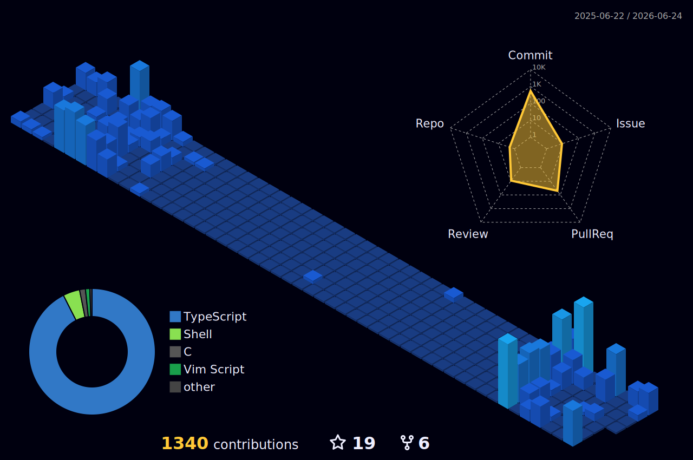

# tanacchi

コード、ツール、Web アプリ、開発環境まわりを作りながら整えています。

## Stack

## GitHub Activity

<picture>
  <source
    srcset="https://github-readme-stats.vercel.app/api?username=tanacchi&show_icons=true&include_all_commits=true&theme=transparent&hide_border=true&rank_icon=github&show=reviews,prs_merged,prs_merged_percentage#gh-dark-mode-only"
    media="(prefers-color-scheme: dark)"
  />
  <source
    srcset="https://github-readme-stats.vercel.app/api?username=tanacchi&show_icons=true&include_all_commits=true&theme=transparent&hide_border=true&rank_icon=github&show=reviews,prs_merged,prs_merged_percentage#gh-light-mode-only"
    media="(prefers-color-scheme: light), (prefers-color-scheme: no-preference)"
  />
  
</picture>
<picture>
  <source
    srcset="https://github-readme-stats.vercel.app/api/top-langs/?username=tanacchi&layout=compact&langs_count=10&hide=jupyter%20notebook,tex&theme=transparent&hide_border=true&card_width=340#gh-dark-mode-only"
    media="(prefers-color-scheme: dark)"
  />
  <source
    srcset="https://github-readme-stats.vercel.app/api/top-langs/?username=tanacchi&layout=compact&langs_count=10&hide=jupyter%20notebook,tex&theme=transparent&hide_border=true&card_width=340#gh-light-mode-only"
    media="(prefers-color-scheme: light), (prefers-color-scheme: no-preference)"
  />
  
</picture>

## Contribution Map

## Featured

| Project | Notes |
| --- | --- |
| [tanacchi.github.io](https://github.com/tanacchi/tanacchi.github.io) | 個人サイトとポートフォリオの公開場所 |
| [your-quiz](https://github.com/tanacchi/your-quiz) | クイズ体験を作る Web アプリ |
| [dotfiles](https://github.com/tanacchi/dotfiles) | 開発環境を再現しやすくする設定群 |

## Links

- Website: <https://tanacchi.github.io/>
- GitHub: <https://github.com/tanacchi>
